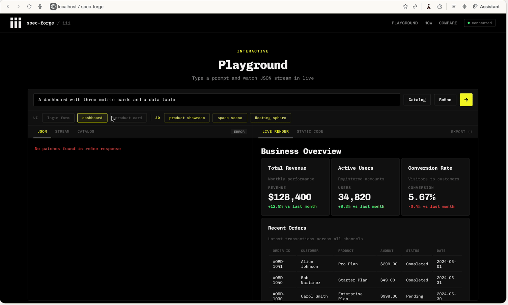

# spec-forge

Pure iii-sdk worker for [json-render](https://github.com/anthropics/json-render) UI generation — JSONL patch streaming, caching, rate limiting, and validation. No standalone HTTP server; all endpoints are iii functions with HTTP triggers served by the iii engine.



```
Browser  ──POST──>  iii-engine (:3111)  ──>  spec-forge worker (Rust)  ──>  Claude API
                         │                           │
                         │                    JSONL patches (RFC 6902)
                         │                           │
Browser  <──WebSocket──  iii Channel (:49134)  <─────┘
     │
     └──>  Progressive render (each patch = 1 component)
```

## Why

json-render calls the LLM on every request. No caching, no streaming, no rate limiting. API key exposed to client.

spec-forge is a pure iii-sdk worker that streams JSONL patches (RFC 6902) through iii Channels — each patch arrives at the browser via WebSocket the moment Claude generates it, so the UI fills in progressively.

| | json-render | spec-forge + iii |
|---|---|---|
| Architecture | Client-side LLM calls | iii worker with HTTP triggers |
| Output format | Full JSON response | JSONL patches (RFC 6902) |
| Streaming | Vercel AI SDK `streamText` | iii Channels (WebSocket) |
| First paint | After full LLM response | After first patch (~200ms) |
| Cache | None | SHA-256 exact + TF-IDF semantic |
| Repeat request | 3-5s LLM call | **0ms** cached |
| Rate limiting | None | Token bucket + concurrency semaphore |
| API key | Client-side | Server-side only |
| Observability | None | OpenTelemetry (built-in via iii) |

## Prerequisites

### Install iii engine

spec-forge runs on the [iii engine](https://github.com/iii-hq/iii). Install it first:

```bash
curl -fsSL https://install.iii.dev/iii/main/install.sh | sh
```

This installs the `iii` CLI to `~/.local/bin/iii`. Make sure `~/.local/bin` is in your `PATH`.

Verify the installation:

```bash
iii --version
```

### Install Rust

spec-forge is a Rust worker. Install Rust if you don't have it:

```bash
curl --proto '=https' --tlsv1.2 -sSf https://sh.rustup.rs | sh
```

## Quick Start

```bash
# 1. Clone and enter
git clone https://github.com/iii-hq/spec-forge.git
cd spec-forge

# 2. Set your Anthropic API key (in .env or environment)
echo "ANTHROPIC_API_KEY=sk-ant-..." > .env

# 3. Start iii engine
iii --config iii-config.yaml &

# 4. Build and run the worker
cargo build --release
./target/release/spec-forge &

# 5. Serve demo UI
cd demo && python3 -m http.server 3112 &
```

Open `http://localhost:3112` for the interactive playground.

## Endpoints

All endpoints are iii functions with HTTP triggers, served by the engine on port 3111:

| Route | Method | Description |
|-------|--------|-------------|
| `/spec-forge/generate` | POST | Generate spec (cache -> semantic -> Claude -> validate) |
| `/spec-forge/stream` | POST | Stream patches via iii Channel (WebSocket) — real-time progressive rendering |
| `/spec-forge/refine` | POST | Patch existing spec with incremental changes |
| `/spec-forge/validate` | POST | Validate spec against component catalog |
| `/spec-forge/prompt` | POST | Preview the LLM prompt that would be sent |
| `/spec-forge/stats` | GET | Rate limiter, cache, and stream metrics |
| `/spec-forge/health` | GET | Liveness check |

## JSONL Patch Protocol (RFC 6902)

Claude outputs one JSON patch operation per line. Each line is independently parseable, enabling real-time streaming:

```jsonl
{"op":"add","path":"/root","value":"main"}
{"op":"add","path":"/elements/main","value":{"type":"Card","props":{"title":"Dashboard"},"children":["metric-1","chart"]}}
{"op":"add","path":"/elements/metric-1","value":{"type":"Metric","props":{"label":"Revenue","value":"$42K"},"children":[]}}
{"op":"add","path":"/elements/chart","value":{"type":"Chart","props":{"title":"Sales"},"children":[]}}
```

Operations: `add`, `replace`, `remove` on paths `/root` and `/elements/{key}`.

## Streaming via iii Channels

The `/stream` endpoint creates an iii Channel (WebSocket-backed pipe) and returns reader credentials:

```bash
curl -X POST http://localhost:3111/spec-forge/stream \
  -H "Content-Type: application/json" \
  -d '{"prompt": "A sales dashboard", "catalog": {...}}'
```

Response:
```json
{
  "cached": false,
  "channel": {
    "channel_id": "ch_abc123",
    "access_key": "key_xyz"
  }
}
```

Connect to the WebSocket to receive patches in real-time:

```
ws://localhost:49134/ws/channels/{channel_id}?key={access_key}&dir=read
```

Messages arrive as:
```json
{"type": "patch", "patch": {"op": "add", "path": "/elements/metric-1", "value": {...}}}
{"type": "done", "spec": {...}, "valid": true, "generation_ms": 1823}
```

Each `patch` message triggers a progressive UI render. The browser never waits for the full LLM response.

## Usage

### Generate (non-streaming)

```bash
curl -X POST http://localhost:3111/spec-forge/generate \
  -H "Content-Type: application/json" \
  -d '{
    "prompt": "A login form with email and password",
    "catalog": {
      "components": {
        "Stack": {"description": "Flex container", "props": {"direction": "vertical|horizontal", "gap": "number"}, "children": true},
        "Card": {"description": "Container card", "props": {"title": "string"}, "children": true},
        "Input": {"description": "Text input", "props": {"placeholder": "string", "type": "string", "label": "string"}},
        "Button": {"description": "Button", "props": {"label": "string", "variant": "primary|secondary"}}
      },
      "actions": {"submit": {"description": "Submit form"}}
    }
  }'
```

Response includes both the final spec and the JSONL patches used to build it:
```json
{
  "spec": {
    "root": "form-card",
    "elements": {
      "form-card": {"type": "Card", "props": {"title": "Login"}, "children": ["form-stack"]},
      "email-input": {"type": "Input", "props": {"placeholder": "you@example.com", "type": "email", "label": "Email"}, "children": []}
    }
  },
  "patches": [
    {"op": "add", "path": "/root", "value": "form-card"},
    {"op": "add", "path": "/elements/form-card", "value": {"type": "Card", "props": {"title": "Login"}, "children": ["form-stack"]}}
  ],
  "cached": false,
  "generation_ms": 2841,
  "model": "claude-sonnet-4-6"
}
```

Second request with same or similar prompt: `"cached": true, "generation_ms": 0`.

### Refine

Send a change request with JSONL patches instead of regenerating from scratch:

```bash
curl -X POST http://localhost:3111/spec-forge/refine \
  -H "Content-Type: application/json" \
  -d '{
    "prompt": "Add a forgot password link",
    "current_spec": {"root": "form-card", "elements": {...}},
    "catalog": {...}
  }'
```

## Demo Playground

The `demo/index.html` playground connects to the iii engine and provides:

- **JSON tab** — syntax-highlighted spec output with JSONL patches
- **STREAM tab** — real-time log of WebSocket patch messages
- **LIVE RENDER** — progressive rendering as patches arrive via WebSocket
- **STATIC CODE** — copy-pasteable React code using `@anthropic-ai/json-render-react`
- **Catalog drawer** — 4 presets (dashboard, form, ecommerce, minimal) with editable JSON
- **Refine** — iteratively modify existing specs without full regeneration

### Component Presets

| Preset | Components |
|--------|-----------|
| Dashboard | Stack, Card, Grid, Heading, Metric, Table, Button, Text, Badge, Divider, Input |
| Form | Stack, Card, Heading, Input, Textarea, Select, Checkbox, Radio, Button, Text, Divider, Badge |
| Ecommerce | Stack, Grid, Card, Heading, Image, Text, Button, Metric, Badge, Divider, List |
| Minimal | Stack, Card, Heading, Text, Button |

## Architecture

spec-forge is a **pure iii-sdk worker** — no Axum, no standalone HTTP server. All endpoints are registered as iii functions with HTTP triggers.

```
iii-engine (iii-config.yaml)
├── RestApiModule (port 3111, CORS)
├── StateModule (file-based KV)
├── OtelModule (traces, metrics, logs)
├── PubSubModule (local)
├── CronModule
└── Channels (WebSocket port 49134)

spec-forge worker (connects via WebSocket)
├── register_functions()     7 iii functions
├── register_http_triggers() 7 HTTP trigger bindings
└── business logic
    ├── generate_core()  cache → semantic → rate limit → Claude → validate → store
    ├── stream_core()    iii Channel → Claude streaming → JSONL patches → WebSocket
    ├── refine_core()    JSONL patch-based refinement (Add/Replace/Remove)
    ├── validate_core()  spec validation against catalog
    ├── prompt_core()    preview LLM prompt
    ├── stats_core()     metrics from iii Streams
    └── health_core()    liveness check
```

### Source Files

```
src/
├── main.rs        # iii worker: SharedState, 7 functions, 7 HTTP triggers, core logic
├── types.rs       # GenerateRequest, Catalog, ComponentDef, ActionDef, UISpec, UIElement
├── cache.rs       # SHA-256 exact cache with TTL (DashMap)
├── semantic.rs    # TF-IDF cosine similarity cache for fuzzy prompt matching
├── limiter.rs     # Rate limiter (token bucket + concurrency semaphore)
├── validate.rs    # Spec validation against component catalog
├── prompt.rs      # LLM prompt builder (JSONL/RFC 6902 format)
└── bench.rs       # Benchmark binary
demo/
├── index.html     # Self-contained playground with WebSocket streaming
└── demo.gif       # Demo recording
client/
├── src/index.ts               # JS/TS client SDK
└── src/json-render-adapter.ts # Adapter for json-render <Render>
```

### iii-sdk Primitives Used

| Primitive | Usage |
|-----------|-------|
| `III::init()` | Initialize worker, connect to engine via WebSocket |
| `register_function_with_description()` | Register 7 named functions with descriptions |
| `register_trigger("http", ...)` | Bind functions to HTTP routes (`api_path` + `http_method`) |
| `ApiRequest<T>` / `ApiResponse<T>` | Typed HTTP request/response wrappers |
| `create_channel()` + `ChannelWriter` | WebSocket-backed streaming pipe for real-time patches |
| `Streams` | Atomic metric counters (cache hits/misses, generation count/ms) |
| `get_context().logger` | Structured logging (info, warn, error) |
| OtelModule | Automatic OpenTelemetry traces, metrics, and logs |

## Tests

```bash
cargo test
```

27 tests: cache (4), semantic (7), limiter (5), validate (6), prompt (5).

## Configuration

### Environment

| Env Var | Default | Description |
|---------|---------|-------------|
| `ANTHROPIC_API_KEY` | required | Claude API key |
| `DOTENV_PATH` | `.env` | Path to .env file |

### iii Engine (iii-config.yaml)

| Module | Config |
|--------|--------|
| RestApiModule | Port 3111, CORS for localhost:3112/3111/3000/5173 |
| StateModule | File-based KV at `./data/state_store.db` |
| OtelModule | Memory exporter, all signals enabled |
| PubSubModule | Local adapter |
| CronModule | KV-backed cron |

### Worker Defaults

Rate limit: 60 req/min + 5 concurrent. Cache TTL: 300s. Semantic threshold: 0.85. Default model: `claude-sonnet-4-6`.

## License

MIT
