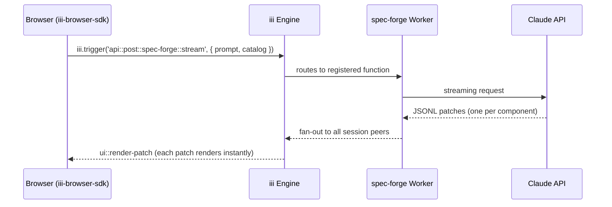
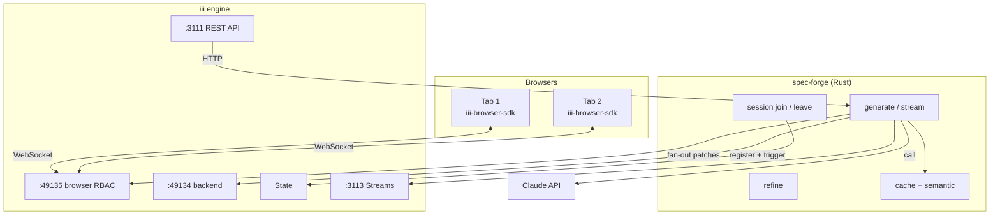

# spec-forge

iii worker that generates UI from natural language. Define a component catalog, call `spec-forge::generate`, get a rendered UI spec back. Add a `session_id` for real-time collaboration across browsers.

Built on [json-render](https://github.com/vercel-labs/json-render) for rendering — all their renderers (React, React Native, PDF, email, video, 3D, terminal) work with specs that spec-forge generates.


## How It Works

spec-forge is a standard iii worker. It registers functions and triggers. You call them.



### From the Browser

```typescript
import { createSpecForge } from '@iii-hq/spec-forge'

// iii = pre-initialized iii-browser-sdk connection to ws://localhost:49135
const specForge = createSpecForge(iii, {
  catalog,
  onPatch: (data) => renderComponent(data),
})

// Generate UI from a prompt
const result = await specForge.generate('A sales dashboard with revenue metrics')

// result.spec → { root: "main", elements: { ... } }
```

### Collaborative Sessions

Open two browser tabs. Both join the same session. One generates — both see it.

```typescript
// Tab 1 and Tab 2 both join
await iii.trigger({
  function_id: 'spec-forge::join-session',
  payload: { body: { session_id: 'team-dashboard', worker_id: 'tab-1' } }
})

// Tab 1 generates — spec-forge fans out patches to all peers
await iii.trigger({
  function_id: 'api::post::spec-forge::stream',
  payload: { body: { prompt: 'Revenue dashboard', catalog, session_id: 'team-dashboard' } }
})

// Tab 2 receives patches via ui::render-patch::tab-2 — renders automatically
```

### Via HTTP (curl, Postman, other services)

Every function also has an HTTP trigger:

```bash
curl -X POST http://localhost:3111/spec-forge/generate \
  -H "Content-Type: application/json" \
  -d '{"prompt": "A login form", "catalog": {"components": {"Input": {"description": "Text input"}, "Button": {"description": "Button"}}}}'
```

## Quick Start

```bash
# 1. Install iii engine
curl -fsSL https://install.iii.dev/iii/main/install.sh | sh

# 2. Clone
git clone https://github.com/iii-hq/spec-forge.git && cd spec-forge

# 3. Set API key
echo "ANTHROPIC_API_KEY=sk-ant-..." > .env

# 4. Start engine
iii --config iii-config.yaml &

# 5. Start worker
cargo build --release && ./target/release/spec-forge &

# 6. Open demo
cd demo && python3 -m http.server 3112
```

Open `http://localhost:3112`. Two tabs = collaborative mode.

## Functions

spec-forge registers these iii functions:

| Function | Description |
|----------|-------------|
| `api::post::spec-forge::generate` | Prompt → cache check → Claude → validate → spec |
| `api::post::spec-forge::stream` | Same but streams JSONL patches via iii Channel |
| `api::post::spec-forge::refine` | Patch existing spec incrementally |
| `api::post::spec-forge::validate` | Validate spec against catalog |
| `api::post::spec-forge::prompt` | Preview the LLM prompt |
| `api::get::spec-forge::stats` | Cache + rate limiter metrics |
| `api::get::spec-forge::health` | Liveness check |
| `api::get::spec-forge::catalogs` | List built-in catalog presets |
| `spec-forge::join-session` | Join collaborative session |
| `spec-forge::leave-session` | Leave session |
| `spec-forge::push-patch` | Push patch to all session peers |

Each function has an HTTP trigger on port 3111 (e.g. `POST /spec-forge/generate`).

## Catalog Presets

| Preset | Components |
|--------|-----------|
| `dashboard` | Stack, Card, Grid, Heading, Metric, Table, Chart, Button, Text, Badge, Divider, Input |
| `form` | Stack, Card, Heading, Input, Textarea, Select, Checkbox, Radio, Button, Text |
| `ecommerce` | Stack, Grid, Card, Heading, Image, Text, Button, Metric, Badge, List |
| `minimal` | Stack, Card, Heading, Text, Button, Input |
| `3d` | 43 Three.js components (geometry, lights, cameras, effects, animation, portals) |
| `3d-product` | Product visualization (sphere, floor, studio lighting, bloom) |

Use `catalog_preset: "dashboard"` instead of defining components manually.

## Renderers

spec-forge generates [json-render](https://github.com/vercel-labs/json-render) specs. Any json-render renderer works:

| Target | Package |
|--------|---------|
| Web | `@json-render/react` |
| 3D | `@json-render/react-three-fiber` |
| PDF | `@json-render/react-pdf` |
| Email | `@json-render/react-email` |
| Video | `@json-render/remotion` |
| Terminal | `@json-render/ink` |
| Mobile | `@json-render/react-native` |
| Next.js | `@json-render/next` |
| shadcn/ui | `@json-render/shadcn` (36 components) |

## Architecture



### Source

```text
src/
├── main.rs      ← worker entry, function registration, core logic
├── session.rs   ← collaborative sessions (join, leave, fan-out, store)
├── types.rs     ← request/response types
├── cache.rs     ← SHA-256 exact cache + TTL
├── semantic.rs  ← TF-IDF cosine similarity cache
├── limiter.rs   ← token bucket + concurrency semaphore
├── validate.rs  ← spec validation (UI + 3D)
├── prompt.rs    ← LLM prompt builder
├── catalogs.rs  ← 6 preset catalogs
└── bench.rs     ← benchmarks
```

## Benchmarks

Real numbers. json-render measured with `@json-render/core` calling Claude API directly (how it works in production). spec-forge measured through iii engine + Rust worker.

### Generate

| | spec-forge + iii | json-render (Vercel) | |
|---|---|---|---|
| Cold (cache miss) | **7.2s** | 10.3s | 1.4x faster |
| Repeat request | **1.8ms** | 10.1s (re-calls LLM) | **5600x faster** |
| 3rd request | **1.8ms** | 9.7s (still re-calls) | **5400x faster** |

json-render has no caching. Every request is a full LLM round-trip.

### Collaboration

| | spec-forge + iii | json-render |
|---|---|---|
| Session join | **1.3ms** | impossible |
| Fan-out to 6 peers | **941µs** | impossible |
| Session state restore | **2.2ms** | impossible |
| Server push to browser | **< 1ms** | impossible |
| Persistent spec across tabs | **yes** | no |

### Transport

| | spec-forge (WebSocket) | json-render (HTTP) |
|---|---|---|
| Connection overhead | 0ms (WebSocket, persistent) | ~80ms per request |
| Cached round-trip | **1.8ms** | N/A |
| Stream trigger | **1.3ms** | N/A |

### Security

| | spec-forge | json-render |
|---|---|---|
| API key | Server-side (Rust worker) | Requires server wrapper to protect |
| Rate limiting | Built-in (token bucket) | None |
| Observability | OpenTelemetry (optional, off by default) | None |

```bash
./bench/run.sh       # Run v2 benchmarks (requires engine + worker)
./bench/run.sh rust  # Rust-only micro-benchmarks
./bench/run.sh all   # Everything
```

## Configuration

| Env Var | Default | Description |
|---------|---------|-------------|
| `ANTHROPIC_API_KEY` | required | Claude API key |
| `DOTENV_PATH` | `.env` | Path to .env file |

Rate limit: 60 req/min + 5 concurrent. Cache TTL: 300s. Semantic threshold: 0.85. Model: `claude-sonnet-4-6`.

## Tests

```bash
cargo test  # 39 tests
```

## License

Apache-2.0
